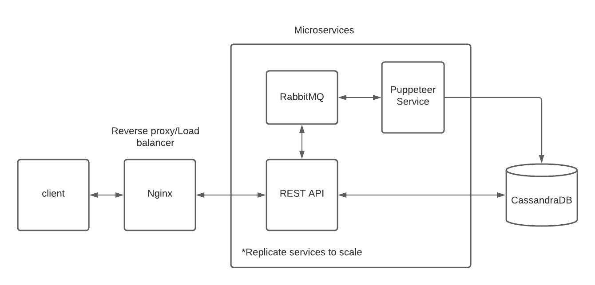

 

  <h3 align="center">TypoSquatter</h3>

  

    A Scalable Distributed Typosquatter Detector
  

***

<!-- TABLE OF CONTENTS -->

  
Table of Contents

  <ol>
    <li>
      <a href="#about-the-project">About The Project</a>
      <ul>
        <li><a href="#features">Features</a></li>
        <li><a href="#built-with">Built With</a></li>
      </ul>
    </li>
    <li><a href="#system-design">System Design</a></li>
    <li><a href="#api-documentation">API Documentation</a></li>
    <li><a href="#installation">Installation</a></li>
    <li><a href="#tests-and-todos">Tests and TODOs</a></li>
  </ol>

***

<!-- ABOUT THE PROJECT -->
## About The Project
Typo-squatting is the practice of registering domain names that are typos of their target domains. Target domains are usually host websites with significant traffic (e.g google.com). Often times, bad faith actors register these typo variants website using them for malicious activity. For more information, visit this [research paper](paper.pdf).

This project's goal is to provide users the ability to view all available typo variants of a website. Users will be able to view html code and a screenshot of these typo variants. It provides information on these typo variants, to determine if there are malicious activity without actually visiting these sites. This allows these typo variants to be safely viewed.

### Typo Variants
1. **Missing-dot:** The "." following "www" is removed, e.g., wwwGoogle.com
2. **Character-omission:** Characters are omitted one at a time, e.g., gogle.com
3. **Character-permutation:** Consecutive characters are swapped one pair at a time, unless they are the same character, e.g., goolge.com
4. **Character-replacement:** Characters are replaced one at a time and the replacement is selected from the set of characters adjacent to the given character on the standard keyboard, e.g., goohle.com
5. **Character-insertion:** Characters are inserted one at a time and the inserted character is chosen from the set of characters adjacent to either of the given pair on the standard keyboard (including the given pair), e.g., googgle.com or googhle.com

### Features
* Generating 5 typo variants for a website(see Typo Variants).
* Retrieve HTML code and screenshot of typo variant of websites.

### Built With

* [Puppeteer](https://developers.google.com/web/tools/puppeteer) Node.js Headless Chrome library
* [RabbitMQ](https://www.rabbitmq.com/) Open Source message broker
* [Express.js](https://expressjs.com/) Node.js web application framework
* [CassandraDB](https://cassandra.apache.org/) NoSQL column database system
* [Nginx](https://www.nginx.com/) Load balancer and reverse proxy
* [PM2](https://pm2.keymetrics.io/) Process manager for Node.js

***

## System Design
****

 

 ***

## API Documentation
TODO

***

### Installation

1. To run the REST API, TODO

2. To run the puppeteer service, TODO

2. To install Puppeteer, RabbitMQ, CassandraDB, Nginx, and PM2, visit the installation or documentation of each technology.

* https://github.com/puppeteer/puppeteer
* https://cassandra.apache.org/doc/latest/getting_started/
* https://www.rabbitmq.com/getstarted.html
* https://pm2.keymetrics.io/docs/usage/quick-start/
* https://www.nginx.com/resources/wiki/start/

***
## Tests and TODOs

### Tests 

crawl_test.js is a development test to understand and use puppeteer.

***TODO - Writing own correctness and scalability test for API

### TODO
1. Writing own correctness and scalability test for API
2. Reduce the manual install and deployment required by the project using deployment tools like docker and ansible
3. Create a frontend app for our API
